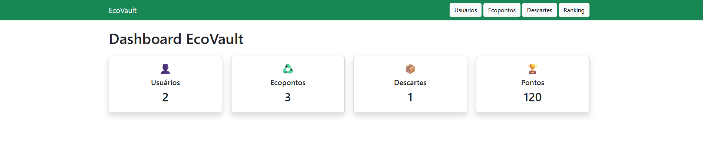
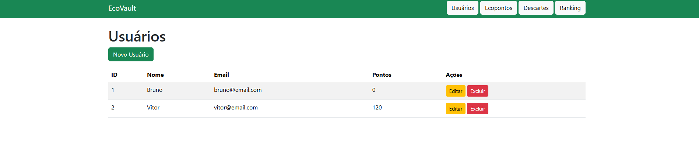
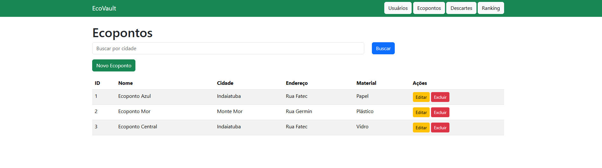
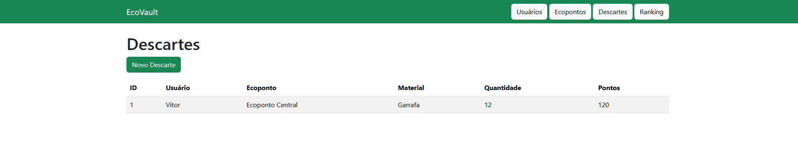

# ♻️ EcoVault

## Sobre o Projeto

O EcoVault é uma plataforma web desenvolvida para incentivar o descarte correto de resíduos eletrônicos através de um sistema de pontuação e gerenciamento de ecopontos.

O sistema permite o cadastro de usuários, ecopontos e descartes, além de gerar pontuação automaticamente para os usuários com base nos materiais descartados.

---

## Tecnologias Utilizadas

* Python 3
* Flask
* SQLAlchemy
* SQLite
* Bootstrap 5
* HTML5
* CSS3
* Jinja2

---

## Arquitetura

O projeto foi desenvolvido seguindo o padrão MVC (Model-View-Controller) e utilizando Repository Pattern para acesso aos dados.

Estrutura principal:

```txt
ecovault-flask/
│
├── controllers/
├── models/
├── repositories/
├── templates/
│   ├── usuarios/
│   ├── ecopontos/
│   └── descartes/
├── static/
├── instance/
├── app.py
├── extensions.py
├── requirements.txt
└── README.md
```

---

## Funcionalidades

### Usuários

* Cadastro de usuários
* Listagem de usuários
* Edição de usuários
* Exclusão de usuários

### Ecopontos

* Cadastro de ecopontos
* Listagem de ecopontos
* Edição de ecopontos
* Exclusão de ecopontos
* Busca por cidade

### Descartes

* Registro de descartes
* Associação entre usuário e ecoponto
* Histórico de descartes

### Sistema de Pontuação

* Geração automática de pontos
* Acúmulo de pontos por usuário

### Ranking

* Ranking dos usuários por pontuação

### Dashboard

* Total de usuários
* Total de ecopontos
* Total de descartes
* Total de pontos gerados

---

## Banco de Dados

O sistema utiliza SQLite com SQLAlchemy ORM.

Tabelas principais:

* usuarios
* ecopontos
* descartes


---

## Como Executar

### Instalar dependências

```bash
pip install -r requirements.txt
```

### Executar aplicação

```bash
python app.py
```

### Acessar sistema

```txt
http://127.0.0.1:5000
```

---

## Objetivo

Promover o descarte consciente de resíduos eletrônicos através da tecnologia, incentivando práticas sustentáveis e a conscientização ambiental.

---

## Telas do Sistema

### Dashboard



### Usuários



### Ecopontos



### Descartes



### Ranking


## Desenvolvido por Bruno Giacomini, Guilherme Onorino, Henrique Campos, Julia Aguiar e Vitor Amorim

Projeto acadêmico desenvolvido para a disciplina de Técnicas de Programação II.
